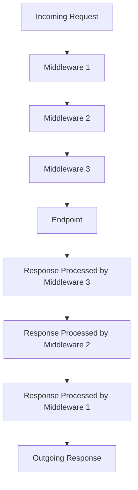

# Understanding .NET Core Middleware: A Practical Guide with `JsonToHtmlMiddleware`

Middleware in .NET Core plays a crucial role in request and response processing within the application pipeline. Acting as a conduit through which requests and responses pass, middleware offers developers the flexibility to modify or handle requests at various points in the pipeline. In this blog, we will explore .NET Core middleware through a real-world example of `JsonToHtmlMiddleware`. This middleware transforms JSON responses into HTML for a richer and more interactive developer interface, utilizing HTMX and PicoCSS for frontend enhancement.

## Introduction to Middleware in .NET Core

Middleware components are assembled into an application pipeline to handle requests and responses. Each component chooses whether to pass the request to the next component or process it. This modularity is advantageous because it allows for clean separation of concerns, scalability, and testing flexibility. Here’s a simple conceptual flowchart of how middleware functions:



## Overview of `JsonToHtmlMiddleware`

The `JsonToHtmlMiddleware` is designed to intercept responses with a JSON content type and convert them into HTML. This middleware is particularly useful for developers who wish to have a quick preview of the data in a web-friendly format, without relying solely on API clients like Postman or Swagger.

Here’s a brief explanation of the key parts of the middleware:

### Capturing the Original Response Stream

The middleware first captures the original response body stream to temporarily store the response:

```csharp
var originalBodyStream = context.Response.Body;
```

### Storing Response in Memory Stream

It then uses a memory stream to temporarily store the response:

```csharp
using (var newBodyStream = new MemoryStream())
{
    context.Response.Body = newBodyStream;
    await _next(context);
}
```

This approach allows the middleware to inspect or modify the response before it is sent to the client.

### JSON to HTML Conversion

If the content type of the response is JSON, the middleware reads the JSON response, converts it to HTML, and then writes the HTML back into the response stream:

```csharp
if (context.Response.ContentType != null && context.Response.ContentType.Contains("application/json"))
{
    var jsonResponse = await new StreamReader(newBodyStream).ReadToEndAsync();
    var htmlResponse = ConvertJsonToHtml(jsonResponse);
    context.Response.ContentType = "text/html";
    context.Response.Body = originalBodyStream;
    await context.Response.WriteAsync(htmlResponse);
}
```

The `ConvertJsonToHtml` method takes care of the transformation, making use of PicoCSS and HTMX to style and handle the interactions within the HTML table.

### Special Handling for Book Updates

The middleware also includes logic to render a different HTML structure when handling specific paths, like an update operation for books:

```csharp
if (context.Request.Path.StartsWithSegments("/api/books") && context.Request.Path.Value.EndsWith("/update"))
{
    var idString = context.Request.Path.Value.Split('/')[3];
    if (int.TryParse(idString, out int id))
    {
        htmlResponse = ConvertJsonToHtml(jsonResponse, "update");
    }
}
```

This tailored response ensures that developers get an appropriate interface based on the operation being performed.

## Pros and Cons of Using Middleware in .NET Core

### Pros

1. **Separation of Concerns**: Middleware allows different aspects of request processing to be isolated into distinct components. For example, logging, authentication, and exception handling can all be managed separately.

2. **Reusability**: Middleware can be reused across multiple applications. This modularity helps maintain consistency and reduces code duplication.

3. **Pipeline Flexibility**: Middleware components can be added, removed, or reordered in the pipeline, providing flexibility in how requests are processed.

4. **Testing and Debugging**: Middleware components can be tested in isolation, which simplifies the debugging process.

### Cons

1. **Complexity**: As the number of middleware components grows, managing the order and interaction between components can become complex.

2. **Performance Overhead**: Each middleware component introduces some processing overhead. Although usually minimal, it can accumulate, especially in high-performance scenarios.

3. **Global Impact**: Middleware operates globally, affecting all requests. This can be a disadvantage if you want to apply logic conditionally or only in specific scenarios.

## Enhancing Developer Experience with a Custom Interface

While tools like Swagger provide a robust interface for API exploration, they often lack the customization and interactivity needed for certain tasks. To address this, `JsonToHtmlMiddleware` integrates HTMX and PicoCSS to create a dynamic developer interface directly within the web application.

### Why Use HTMX and PicoCSS?

- **HTMX**: This tool enables developers to build modern user interfaces with minimal JavaScript. It allows HTML elements to make requests and dynamically update the DOM based on server responses.
  
- **PicoCSS**: A minimalist CSS framework, PicoCSS helps in quickly styling the UI with a clean and simple design aesthetic.

These tools together create an efficient and interactive interface, allowing developers to test API endpoints directly from the web application, previewing the results in real-time.

### Example Interface

Imagine you’re working with an API endpoint that returns a list of books. Instead of viewing raw JSON in Swagger or Postman, `JsonToHtmlMiddleware` can render a table with the book details, offering inline editing capabilities with just a few clicks.


This interface not only makes the testing process more intuitive but also provides immediate feedback on how changes will look in a production environment.

## Conclusion

Middleware in .NET Core is a powerful tool for shaping the behavior of your application pipeline. The `JsonToHtmlMiddleware` example showcases how middleware can be leveraged to enhance the developer experience, offering more than just raw data views by integrating interactive elements directly into the web interface.

By using HTMX and PicoCSS, we’ve extended the capabilities of the traditional API, creating a more dynamic and user-friendly environment for developers. While middleware introduces some complexity, its benefits in terms of modularity, reusability, and flexibility often outweigh the downsides, making it an essential part of any .NET Core developer’s toolkit.

If you’re interested in exploring the full implementation of this middleware, you can check out the codebase [here](https://github.com/rajeshradhakrishnanmvk/ai_library.git). Happy coding!
