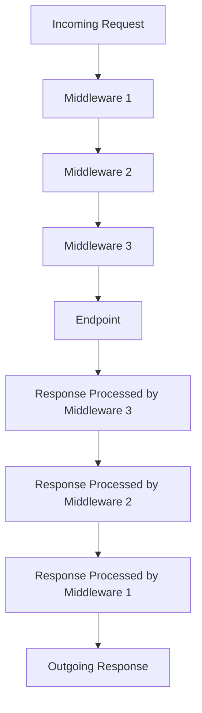
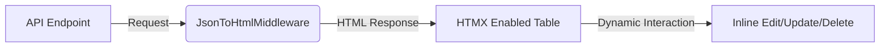

# Understanding .NET Core Middleware: A Practical Guide with `JsonToHtmlMiddleware`

Middleware in .NET Core plays a crucial role in request and response processing within the application pipeline. Acting as a conduit through which requests and responses pass, middleware offers developers the flexibility to modify or handle requests at various points in the pipeline. In this blog, we will explore .NET Core middleware through a real-world example of `JsonToHtmlMiddleware`. This middleware transforms JSON responses into HTML for a richer and more interactive developer interface, utilizing HTMX and PicoCSS for frontend enhancement.
## Project Setup

```
dotnet build
dotnet tool install --global dotnet-ef --version 8.*
dotnet ef migrations add m1 -o Data/Migrations
dotnet ef database update
dotnet add package Microsoft.SemanticKernel --version=1.15.0
dotnet add package PdfSharpCore
dotnet run
```
## Introduction to Middleware in .NET Core

Middleware components are assembled into an application pipeline to handle requests and responses. Each component chooses whether to pass the request to the next component or process it. This modularity is advantageous because it allows for clean separation of concerns, scalability, and testing flexibility. Here’s a simple conceptual flowchart of how middleware functions:



## Overview of `JsonToHtmlMiddleware`

The `JsonToHtmlMiddleware` is designed to intercept responses with a JSON content type and convert them into HTML. This middleware is particularly useful for developers who wish to have a quick preview of the data in a web-friendly format, without relying solely on API clients like Postman or Swagger.

Here’s a brief explanation of the key parts of the middleware:

### Capturing the Original Response Stream

The middleware first captures the original response body stream to temporarily store the response:

```csharp
var originalBodyStream = context.Response.Body;
```

### Storing Response in Memory Stream

It then uses a memory stream to temporarily store the response:

```csharp
using (var newBodyStream = new MemoryStream())
{
    context.Response.Body = newBodyStream;
    await _next(context);
}
```

This approach allows the middleware to inspect or modify the response before it is sent to the client.

### JSON to HTML Conversion

If the content type of the response is JSON, the middleware reads the JSON response, converts it to HTML, and then writes the HTML back into the response stream:

```csharp
if (context.Response.ContentType != null && context.Response.ContentType.Contains("application/json"))
{
    var jsonResponse = await new StreamReader(newBodyStream).ReadToEndAsync();
    var htmlResponse = ConvertJsonToHtml(jsonResponse);
    context.Response.ContentType = "text/html";
    context.Response.Body = originalBodyStream;
    await context.Response.WriteAsync(htmlResponse);
}
```

The `ConvertJsonToHtml` method takes care of the transformation, making use of PicoCSS and HTMX to style and handle the interactions within the HTML table.

### Special Handling for Book Updates

The middleware also includes logic to render a different HTML structure when handling specific paths, like an update operation for books:

```csharp
if (context.Request.Path.StartsWithSegments("/api/books") && context.Request.Path.Value.EndsWith("/update"))
{
    var idString = context.Request.Path.Value.Split('/')[3];
    if (int.TryParse(idString, out int id))
    {
        htmlResponse = ConvertJsonToHtml(jsonResponse, "update");
    }
}
```

This tailored response ensures that developers get an appropriate interface based on the operation being performed.

## Pros and Cons of Using Middleware in .NET Core

### Pros

1. **Separation of Concerns**: Middleware allows different aspects of request processing to be isolated into distinct components. For example, logging, authentication, and exception handling can all be managed separately.

2. **Reusability**: Middleware can be reused across multiple applications. This modularity helps maintain consistency and reduces code duplication.

3. **Pipeline Flexibility**: Middleware components can be added, removed, or reordered in the pipeline, providing flexibility in how requests are processed.

4. **Testing and Debugging**: Middleware components can be tested in isolation, which simplifies the debugging process.

### Cons

1. **Complexity**: As the number of middleware components grows, managing the order and interaction between components can become complex.

2. **Performance Overhead**: Each middleware component introduces some processing overhead. Although usually minimal, it can accumulate, especially in high-performance scenarios.

3. **Global Impact**: Middleware operates globally, affecting all requests. This can be a disadvantage if you want to apply logic conditionally or only in specific scenarios.

## Enhancing Developer Experience with a Custom Interface

While tools like Swagger provide a robust interface for API exploration, they often lack the customization and interactivity needed for certain tasks. To address this, `JsonToHtmlMiddleware` integrates HTMX and PicoCSS to create a dynamic developer interface directly within the web application.

### Why Use HTMX and PicoCSS?

- **HTMX**: This tool enables developers to build modern user interfaces with minimal JavaScript. It allows HTML elements to make requests and dynamically update the DOM based on server responses.
  
- **PicoCSS**: A minimalist CSS framework, PicoCSS helps in quickly styling the UI with a clean and simple design aesthetic.

These tools together create an efficient and interactive interface, allowing developers to test API endpoints directly from the web application, previewing the results in real-time.

### Example Interface

Imagine you’re working with an API endpoint that returns a list of books. Instead of viewing raw JSON in Swagger or Postman, `JsonToHtmlMiddleware` can render a table with the book details, offering inline editing capabilities with just a few clicks.



This interface not only makes the testing process more intuitive but also provides immediate feedback on how changes will look in a production environment.

## Conclusion

Middleware in .NET Core is a powerful tool for shaping the behavior of your application pipeline. The `JsonToHtmlMiddleware` example showcases how middleware can be leveraged to enhance the developer experience, offering more than just raw data views by integrating interactive elements directly into the web interface.

By using HTMX and PicoCSS, we’ve extended the capabilities of the traditional API, creating a more dynamic and user-friendly environment for developers. While middleware introduces some complexity, its benefits in terms of modularity, reusability, and flexibility often outweigh the downsides, making it an essential part of any .NET Core developer’s toolkit.

If you’re interested in exploring the full implementation of this middleware, you can check out the codebase [here](https://github.com/rajeshradhakrishnanmvk/ai_library.git). Happy coding!


```
export GROQ_API_KEY=<your-api-key-here>

curl -X POST "https://api.groq.com/openai/v1/chat/completions" -H "Authorization: Bearer $GROQ_API_KEY" -H "Content-Type: application/json" -d '{"messages":[{"role":"system","content":"You are a highly intelligent literary agent, helping readers choose their next book based on textual analysis."},{"role":"user","content":"what is the 
next book to read?"}],"model":"llama3-8b-8192"}'
633;C{"id":"chatcmpl-fcf4ade3-d618-4431-a186-c1dd112c7187","object":"chat.completion","created":1727276659,"model":"llama3-8b-8192","choices":[{"index":0,"message":{"role":"assistant","content":"I'd be delighted to make a recommendation for you!\n\nTo generate a personalized suggestion, I'll need to ask you a few questions. Please consider the following:\n\n1. What genre or type of book are you in the mood for? (e.g., fiction, non-fiction, mystery, sci-fi, fantasy, romance, etc.)\n2. Do you prefer books with:\n\t* Complex, thought-provoking themes and characters\n\t* Light, easy-reading entertainment\n\t* Humor and wit\n\t* A mix of everything\n3. Are you interested in:\n\t* A standalone novel\n\t* A series or series starter\n\t* A book with a unique narrative structure or format\n4. How much time do you have to dedicate to reading? Are you looking for a:\n\t* Quick, bite-sized read (less than 200 pages)\n\t* Medium-length book (200-400 pages)\n\t* Immersive, longer read (400+ pages)\n5. Are there any specific authors, styles, or themes you've enjoyed in the past?\n\nPlease answer these questions, and I'll use my textual analysis skills to recommend a book that suits your tastes!"},"logprobs":null,"finish_reason":"stop"}],"usage":{"queue_time":0.007878811999999999,"prompt_tokens":42,"prompt_time":0.005459438,"completion_tokens":241,"completion_time":0.200833333,"total_tokens":283,"total_time":0.206292771},"system_fingerprint":"fp_179b0f92c9","x_groq":{"id":"req_01j8mvcd21ftt98c4zmqyp5hgv"}}
```
curl https://api.groq.com/openai/v1/chat/completions \
-H "Content-Type: application/json" \
-H "Authorization: Bearer $GROQ_API_KEY" \
-d '{
  "model": "llama3-groq-70b-8192-tool-use-preview",
  "messages": [
    {
      "role": "user",
      "content": "What'\''s the weather like in Boston today?"
    }
  ],
  "tools": [
    {
      "type": "function",
      "function": {
        "name": "get_current_weather",
        "description": "Get the current weather in a given location",
        "parameters": {
          "type": "object",
          "properties": {
            "location": {
              "type": "string",
              "description": "The city and state, e.g. San Francisco, CA"
            },
            "unit": {
              "type": "string",
              "enum": ["celsius", "fahrenheit"]
            }
          },
          "required": ["location"]
        }
      }
    }
  ],
  "tool_choice": "auto"
}'

curl -X POST "https://api.groq.com/openai/v1/chat/completions" -H "Authorization: Bearer $GROQ_API_KEY" -H "Content-Type: application/json" -d '{"messages":[{"role":"system","content":"You are a highly intelligent literary agent, helping readers choose their next book based on textual analysis."},{"role":"user","content":"what is the next book to read?"}],"tools":[{"type":"function","function":{"name":"textual_analysis","description":"Analyze the structure, thesis, and evidence in a given book or text"}}],"tool_choice":"auto","max_tokens":4096, "model":"llama3-groq-70b-8192-tool-use-preview"}'


633;C{"id":"chatcmpl-643e5871-e1c1-46ed-8085-4972ca2061a6","object":"chat.completion","created":1727277194,"model":"llama3-groq-70b-8192-tool-use-preview","choices":[{"index":0,"message":{"role":"assistant","content":"To provide a tailored recommendation, I'll need to analyze a few books you've enjoyed in the past. Could you list a couple of books you've liked and why you enjoyed them?"},"logprobs":null,"finish_reason":"stop"}],"usage":{"queue_time":0.008314681,"prompt_tokens":178,"prompt_time":0.014513657,"completion_tokens":38,"completion_time":0.119032648,"total_tokens":216,"total_time":0.133546305},"system_fingerprint":"fp_ee4b521143","x_groq":{"id":"req_01j8mvwpqme2j8db5cr79m4ge4"}}


[{"role":{"label":"assistant"},"items":[{"$type":"TextContent","text":"You are a helpful assistant and you know about the author Chinua Achebe, about the book Things Fall Apart which was published during 1958"}]},{"role":{"label":"user"},"items":[{"$type":"TextContent","text":"what is the plot of the book in 50 words?"}]},{"role":{"label":"assistant"},"items":[{"$type":"TextContent","text":"\"Things Fall Apart\" tells the story of Okonkwo, a respected warrior and leader in an Igbo village in Nigeria. His life is thrown into turmoil by the arrival of European colonizers who impose their culture and religion on the village, leading to Okonkwo's tragic downfall as he struggles to adapt."}]}]

--------------------------JSON Columns----------------------------
ref: https://github.com/dotnet/EntityFramework.Docs/blob/main/samples/core/Miscellaneous/NewInEFCore8/JsonColumnsSample.cs

To implement JSON columns in your provided classes using EF Core 8, we can take advantage of the new JSON column support for storing complex objects directly into relational databases. Below is an implementation that reflects this approach, based on your `Book`, `BooksDetails`, and `AgentChat` classes.

### Step 1: Models Setup
```csharp
namespace BooksApi.Models
{
    using System.Text.Json.Serialization;

    public class Book
    {
        [JsonPropertyName("bookId")]
        public int BookId { get; set; }

        [JsonPropertyName("name")]
        public string? Name { get; set; }

        [JsonPropertyName("author")]
        public string? Author { get; set; }

        [JsonPropertyName("description")]
        public string? Description { get; set; }

        [JsonPropertyName("library")]
        public string? Library { get; set; }

        public BooksDetails Conversation { get; set; } = null!;
    }

    public class BooksDetails
    {
        public AgentChat AgentChat { get; set; } = null!;
        public string? AgentName { get; set; }
        public string? AgentInstruction { get; set; }
    }

    public class AgentChat
    {
        public AgentChat(string role, string message)
        {
            Role = role;
            Message = message;
        }

        public string Role { get; set; }
        public string Message { get; set; }
    }
}
```

### Step 2: DbContext and Configuration

In EF Core 8, we can store JSON data using `ToJson()` which handles storing and querying JSON columns. Here's how to configure the `BooksDetails` property as a JSON column:

```csharp
using Microsoft.EntityFrameworkCore;
using Microsoft.EntityFrameworkCore.Metadata.Builders;

namespace BooksApi.Models
{
    public class BooksContext : DbContext
    {
        public DbSet<Book> Books { get; set; }

        public BooksContext(DbContextOptions<BooksContext> options) : base(options) { }

        protected override void OnModelCreating(ModelBuilder modelBuilder)
        {
            modelBuilder.Entity<Book>(entity =>
            {
                // Maps the BooksDetails property as a JSON column
                entity.OwnsOne(b => b.Conversation)
                      .ToJson(); // Converts the Conversation property into a JSON column
            });
        }
    }
}
```

### Step 3: Migrations

You can now add a migration and update the database to support the JSON column for `BooksDetails`:

```bash
dotnet ef migrations add AddJsonColumnForBooksDetails
dotnet ef database update
```

### Step 4: Inserting and Querying JSON Data

You can now insert data and query JSON columns as follows:

#### Inserting a New Book:
```csharp
var newBook = new Book
{
    BookId = 1,
    Name = "Data Storage Evolution",
    Author = "John Doe",
    Description = "Unlocking JSON Columns in .NET Core 8",
    Library = "Central Library",
    Conversation = new BooksDetails
    {
        AgentChat = new AgentChat("Assistant", "How can I help you today?"),
        AgentName = "SupportBot",
        AgentInstruction = "Always assist politely"
    }
};

_context.Books.Add(newBook);
await _context.SaveChangesAsync();
```

#### Querying a Book:
```csharp
var book = await _context.Books
    .Where(b => b.BookId == 1)
    .FirstOrDefaultAsync();

var agentMessage = book?.Conversation?.AgentChat?.Message;
Console.WriteLine(agentMessage); // Outputs: How can I help you today?
```

### Conclusion

By using `.ToJson()` in EF Core 8, the `BooksDetails` object in the `Book` class can be stored directly in a relational database as a JSON column. This provides flexibility for handling complex, nested data structures efficiently.
------------------------------
To update a `Book` with a new message added to the existing `AgentChat` conversation in EF Core 8, you can retrieve the book, modify the `AgentChat.Message`, and save the changes.

Here's the implementation:

### Step 1: Fetch the Book and Update Conversation

```csharp
public async Task<IActionResult> UpdateBookConversation(int bookId, string newMessage)
{
    // Fetch the book by its ID
    var book = await _context.Books
                             .FirstOrDefaultAsync(b => b.BookId == bookId);

    if (book == null)
    {
        return NotFound();
    }

    // Append the new message to the existing conversation
    book.Conversation.AgentChat.Message += $"\n{newMessage}";

    // Save changes to the database
    await _context.SaveChangesAsync();

    return Ok(book);
}
```

### Explanation:
- **Fetching the book**: The book is retrieved based on its `bookId`.
- **Updating the conversation**: The new message is appended to the `AgentChat.Message` property.
- **Saving changes**: The updated book is saved back to the database.

This will append the new message to the existing conversation in the JSON column.


To seed dummy data into the `Conversation` column during a migration, you can use the `HasData` method in the `OnModelCreating` method of your `DbContext`.

Here’s how you can seed data into the `BooksDetails` JSON column:

### Step 1: Add Dummy Data Using `HasData`

```csharp
protected override void OnModelCreating(ModelBuilder modelBuilder)
{
    // Seed data for the Book entity with JSON details in Conversation
    modelBuilder.Entity<Book>().HasData(
        new Book
        {
            BookId = 1,
            Name = "Data Storage Evolution",
            Author = "John Doe",
            Description = "Unlocking JSON Columns",
            Library = "Main Library",
            Conversation = new BooksDetails
            {
                AgentChat = new AgentChat("Assistant", "Hello! How can I assist you?"),
                AgentName = "BotOne",
                AgentInstruction = "Be polite at all times."
            }
        }
    );

    // Ensure the conversation JSON is stored correctly
    modelBuilder.Entity<Book>()
        .OwnsOne(b => b.Conversation)
        .ToJson();
}
```

### Step 2: Run Migration

After defining the seeding logic in `OnModelCreating`, run the migration and update the database:

```bash
dotnet ef migrations add SeedInitialData
dotnet ef database update
```

### Explanation:
- **`HasData`**: Seeds the initial data for `Book` and the JSON column `Conversation`.
- **`ToJson()`**: Ensures that the `BooksDetails` property is stored as JSON.

This will populate the `Conversation` column with dummy data during migration.


----------------------

Step 1: Create a Custom Migration
dotnet ef migrations add UpdateBooksWithConversation

Step 2: Modify the Migration
protected override void Up(MigrationBuilder migrationBuilder)
{
    migrationBuilder.Sql(
        @"UPDATE Books SET Conversation = json_object(
            'AgentChat', json_object('Role', 'Assistant', 'Message', 'Hello! How can I assist you?'),
            'AgentName', 'BotOne',
            'AgentInstruction', 'Be polite at all times')"
    );
}

protected override void Down(MigrationBuilder migrationBuilder)
{
    migrationBuilder.Sql(@"UPDATE Books SET Conversation = null");
}


Step 3: Apply the Migration
dotnet ef database update